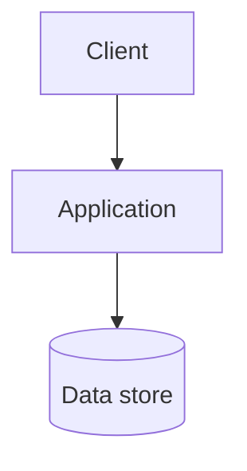

<!-- AGENT-FIRST NOTICE -->
> [!IMPORTANT]
> ### 🤖 Read this with your AI agent — don't read it by hand.
> This repo is written agent-first. Point Claude Code, GitHub Copilot, Cursor, or any agent at it:
> *"Read the README and AGENTS.md, then help me run / extend this."*
> Structure + [`AGENTS.md`](AGENTS.md) are optimized for agent comprehension.
<!-- /AGENT-FIRST NOTICE -->

<div align="center"><a name="readme-top"></a>

<!-- Optional hero image / logo:

-->

# 🚀 A11y Loop

### 

a11y-loop makes AI coding agents write accessible UI by default, then proves what it can prove with a real browser audit across the states it built — and tells you exactly what it could not check.

[Live Demo][demo-link] · [Documentation][docs-link] · [Changelog](CHANGELOG.md) · [Report Bug](https://github.com/ChanMeng666/a11y-loop/issues) · [Request Feature](https://github.com/ChanMeng666/a11y-loop/issues)

<!-- SHIELD GROUP -->

[](LICENSE)
[](https://github.com/ChanMeng666/a11y-loop/actions)
[](https://github.com/ChanMeng666/a11y-loop/graphs/contributors)
[](https://github.com/ChanMeng666/a11y-loop/network/members)
[](https://github.com/ChanMeng666/a11y-loop/stargazers)
[](https://github.com/ChanMeng666/a11y-loop/issues)
[](https://github.com/sponsors/ChanMeng666)

<!-- Tech stack badges — replace with your real stack:


-->

</div>

<details>
<summary><kbd>📑 Table of Contents</kbd></summary>

- [🌟 Introduction](#-introduction)
- [✨ Key Features](#-key-features)
- [🛠️ Tech Stack](#-tech-stack)
- [🏗️ Architecture](#-architecture)
- [🚀 Getting Started](#-getting-started)
- [🛳 Deployment](#-deployment)
- [📖 Usage Guide](#-usage-guide)
- [⌨️ Development](#-development)
- [🤝 Contributing](#-contributing)
- [❤️ Sponsor](#-sponsor)
- [📄 License](#-license)
- [🙋‍♀️ Author](#-author)

</details>

## 🌟 Introduction

a11y-loop makes AI coding agents write accessible UI by default, then proves what it can prove with a real browser audit across the states it built — and tells you exactly what it could not check.

<!-- Expand: the problem, the goal, who it's for, and what makes it stand out. -->

## ✨ Key Features

`1` **Feature One** — _what it does and the value it delivers._

`2` **Feature Two** — _…_

`3` **Feature Three** — _…_

## 🛠️ Tech Stack

<!-- Replace with your real stack and short notes per layer. -->

- **Frontend:** _…_
- **Backend:** _…_
- **Infrastructure / DevOps:** _…_

## 🏗️ Architecture

<details>
<summary><kbd>System overview</kbd></summary>



</details>

<!-- Add component, data-flow, and project-structure diagrams as the project grows. -->

## 🚀 Getting Started

### Prerequisites

<!-- Required runtimes/tools and versions. -->

### Installation

```bash
# Install dependencies
npm install

# Run the test suite
npm test
```

### Environment Setup

<!-- Document required env vars (e.g. copy .env.example to .env and fill in). -->

## 🛳 Deployment

<!-- Describe how to deploy (Vercel/Docker/cloud), env vars, and any build steps. -->

## 📖 Usage Guide

### Basic Usage

```bash
# minimal end-to-end example
```

### Advanced Configuration

<!-- Options, flags, API reference tables. -->

## ⌨️ Development

```bash
# local setup, common scripts, how to add a feature
```

See [`AGENTS.md`](AGENTS.md) for AI-agent-oriented project conventions and gotchas.

## 🤝 Contributing

Contributions make the open-source community an amazing place to learn and create. Please read the
[Contributing Guide](CONTRIBUTING.md) and the [Code of Conduct](CODE_OF_CONDUCT.md) before you start,
and use the provided issue / pull-request templates.

## ❤️ Sponsor

If this project helps you, please consider supporting its development:

[](https://github.com/sponsors/ChanMeng666)
[](https://buymeacoffee.com/chanmeng66u)

For questions and help, see [SUPPORT.md](SUPPORT.md). For security issues, see [SECURITY.md](SECURITY.md).

## 📄 License

This project is released under the [MIT](LICENSE) license.

## 🙋‍♀️ Author

**Chan Meng**

[](mailto:chanmeng.dev@gmail.com)
[](https://github.com/ChanMeng666)

<div align="right">

[](#readme-top)

</div>

<!-- Link definitions — fill these in -->
[demo-link]: #
[docs-link]: #

---

<!-- CHAN MENG PERSONAL BRAND -->
<div align="center">
  <a href="https://github.com/ChanMeng666" target="_blank">
    
  </a>

  <p><strong>Chan Meng</strong><br/>Need a custom app like this one? I build them — let's talk.</p>

  <a href="mailto:chanmeng.dev@gmail.com"></a>
  <a href="https://github.com/ChanMeng666"></a>
</div>
<!-- /CHAN MENG PERSONAL BRAND -->
