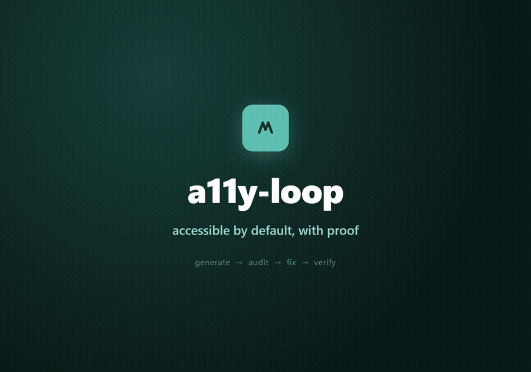
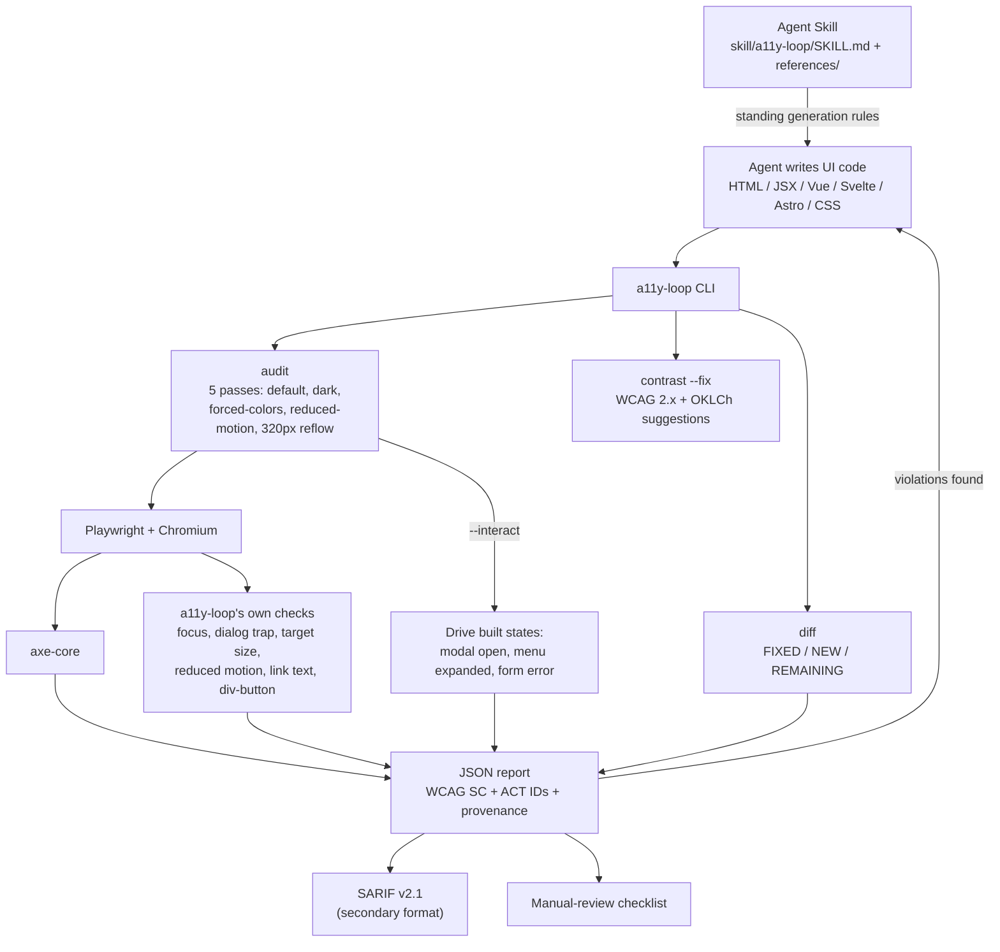

<!-- AGENT-FIRST NOTICE -->
> [!IMPORTANT]
> ### 🤖 Read this with your AI agent — don't read it by hand.
> This repo is written agent-first. Point Claude Code, GitHub Copilot, Cursor, or any agent at it:
> *"Read the README and AGENTS.md, then help me run / extend this."*
> Structure + [`AGENTS.md`](AGENTS.md) are optimized for agent comprehension.
<!-- /AGENT-FIRST NOTICE -->

<div align="center"><a name="readme-top"></a>

# 🔁 a11y-loop

### Write accessible UI by default. Verify it in a real browser. Say exactly what you couldn't check.

a11y-loop makes AI coding agents write accessible UI by default, then proves what it can prove
with a real browser audit across the states it built — and tells you exactly what it could not
check.

[Demo GIF][demo-link] · [SKILL.md][docs-link] · [Benchmark](evals/benchmark-results.md) · [Changelog](CHANGELOG.md) · [Report Bug](https://github.com/ChanMeng666/a11y-loop/issues) · [Request Feature](https://github.com/ChanMeng666/a11y-loop/issues)

<!-- SHIELD GROUP -->

[](LICENSE)
[](https://github.com/ChanMeng666/a11y-loop/graphs/contributors)
[](https://github.com/ChanMeng666/a11y-loop/network/members)
[](https://github.com/ChanMeng666/a11y-loop/stargazers)
[](https://github.com/ChanMeng666/a11y-loop/issues)
[](https://github.com/sponsors/ChanMeng666)


</div>

<details>
<summary><kbd>📑 Table of Contents</kbd></summary>

- [🌟 Introduction](#-introduction)
- [🎬 Demo](#-demo)
- [✨ Key Features](#-key-features)
- [📊 Honest Coverage](#-honest-coverage)
- [📈 Benchmark](#-benchmark)
- [🛠️ Tech Stack](#-tech-stack)
- [🏗️ Architecture](#-architecture)
- [🚀 Getting Started](#-getting-started)
- [⚙️ Using it in CI](#-using-it-in-ci)
- [📖 Usage Guide](#-usage-guide)
- [⌨️ Development](#-development)
- [🤝 Contributing](#-contributing)
- [❤️ Sponsor](#-sponsor)
- [📄 License](#-license)
- [🙋‍♀️ Author](#-author)

</details>

## 🌟 Introduction

AI coding agents write inaccessible UI by default — 84% of AI-generated web pages carry
accessibility issues (W4A'24), and telling the model to "be accessible" barely moves that number:
accessibility-oriented prompts have measured a *slightly higher* violation rate than
accessibility-agnostic ones (W4A'25, 17.32% vs. 15.93%). Instructions alone are not the fix.

a11y-loop is two things working together:

1. **An Agent Skill** — standing generation rules (semantic HTML first, ARIA discipline, APG
   keyboard contracts, labels, focus visibility, AA contrast in light and dark, reduced motion,
   24×24 targets) that apply while the agent is writing UI code.
2. **A Node CLI** (`a11y-loop audit` / `contrast --fix` / `diff`) that verifies the result in a
   real browser, feeds failures back to the agent to fix, and re-audits until the loop converges.

The skill follows the open [Agent Skills](https://agentskills.io/specification) standard, so the
same `SKILL.md` is portable across 40+ clients — Claude Code, Cursor, GitHub Copilot, Codex,
Gemini CLI, and more — not just one vendor's agent. The CLI runs the same checks standalone in CI
or any other pipeline.

It was built for the **My Life My Voice** accessibility challenge, run by a disability
organization in Aotearoa New Zealand, where the NZ Government Web Accessibility Standard 1.2 has
mandated WCAG 2.2 AA since 17 March 2025. The idea: give AI coding agents a way to build
accessibility in from the start, instead of treating it as a compliance afterthought bolted on
after the fact. a11y-loop has no affiliation with My Life My Voice or the NZ government beyond
having been built for that challenge.

**What this is not.** a11y-loop does not claim compliance, does not guarantee accessibility, and
does not replace manual testing or testing with assistive technology. A clean report means "no
automatically detectable failures" — see [Honest Coverage](#-honest-coverage) below for exactly
what that does and doesn't cover.

## 🎬 Demo



The demo page ([`demo/before/`](demo/before)) is a fictional conference site seeded with
**163 detectable failures** spanning the WebAIM Million's top six failure classes plus the
failure modes documented for LLM-generated UI: clickable divs, hidden focus indicators, skipped
heading levels, broken ARIA references, and ignored `prefers-reduced-motion`. Running the loop
against it converges on [`demo/after/`](demo/after) — **0 violations** — and
`a11y-loop diff --before demo/before/report.json --after demo/after/report.json` reports:

```
Converged: all 163 violations fixed, none introduced
```

`FIXED` / `NEW` / `REMAINING` status per finding, matched by stable fingerprint (rule + selector +
WCAG success criterion), is what makes that verdict checkable rather than asserted — see
[`demo/before/VIOLATIONS.md`](demo/before/VIOLATIONS.md) and
[`demo/after/FIXES.md`](demo/after/FIXES.md) for the finding-by-finding record.

## ✨ Key Features

`1` **Five rendering passes per audit** — default (1280×720), dark mode, forced-colors mode,
reduced-motion, and a 320×256 reflow viewport (the WCAG-sanctioned 400% zoom equivalent for
SC 1.4.10) — because most real failures only show up under a specific rendering condition, not on
a single default-viewport load.

`2` **Checks axe-core can't run** — tab order, focus visibility (including focus-ring contrast),
dialog focus trap / Escape / focus-return, target size (24×24 CSS px, SC 2.5.8), reduced-motion
effectiveness, ambiguous link text, div-as-button, and positive `tabindex`. These sit alongside
axe-core, not instead of it.

`3` **State coverage, not just page-load** — `--interact` drives the states an agent just built
(a modal opened, a menu expanded, a form in its error state) through the same five passes, because
axe running once on page load finds nothing in a dialog that only misbehaves once it's open.

`4` **Stable fingerprints power regression detection** — `a11y-loop diff` matches findings across
two reports by rule + selector + WCAG success criterion and classifies each as FIXED, NEW
(a regression — this fails the command even if the total count went down), or REMAINING.

`5` **Structured, honest output** — JSON is the primary format: every finding carries its WCAG
success criterion, ACT rule ID where one exists, and a provenance block (axe-core version, browser,
URL, viewport, timestamp, states exercised). SARIF v2.1 is available as a secondary format with
[a documented limitation](#-honest-coverage) rather than a silent gap. A generated manual-review
checklist, scoped to what was actually built, ships with every run.

`6` **Exit codes are the loop's contract** — `0` no violations / threshold met / no regression,
`1` violations found / regression introduced, `2` tool error — so a CI pipeline or an agent's own
control flow can branch on the result without parsing prose.

`7` **`contrast --fix`** — checks a foreground/background pair against WCAG 2.x (1.4.3: 4.5:1
normal text / 3:1 large text; 1.4.11: 3:1 for UI components) and, on failure, suggests passing
colors in both directions (lighter and darker) in OKLCh, so a fix stays close to the original hue
instead of jumping to black or white.

`8` **Portable as an Agent Skill** — plain `SKILL.md` + `references/`, no proprietary format, works
in any client implementing the open Agent Skills standard, not only Claude Code.

## 📊 Honest Coverage

Automated accessibility testing has a real, bounded scope, and a11y-loop says so in every report
rather than implying otherwise:

- Deque's own research puts automated coverage at **~57% of accessibility issues by volume**
  across a 13,000+ page / ~300,000 issue study — but only **~31% of WCAG 2.2 AA success criteria**
  have *any* automated rule at all, and only **~13% are reliably automatable** end-to-end.
- **A clean a11y-loop report means "no automatically detectable failures were found" — it is
  never a conformance or compliance claim**, and the tool will not tell you your app is
  accessible, compliant, or free of legal risk. No single score is ever produced.
- Every run emits a **generated manual-review checklist**, scoped to the components actually
  built, naming the criteria that need a human and/or assistive-technology testing (screen reader
  behavior, descriptive quality of alt text and link text, logical reading order, caption/media
  alternative accuracy, cognitive accessibility) — the direct inverse of "no manual testing
  needed."
- axe-core's own `incomplete` results are surfaced as `needsReview`, not suppressed. See
  `evals/benchmark-results.md` for a live example of two such findings being investigated and
  resolved rather than dismissed.
- **SARIF caveat, stated honestly:** GitHub Code Scanning only displays SARIF results that carry a
  file-path location. a11y-loop's findings are located by rendered URL + CSS selector, which
  Code Scanning drops on ingestion — a naive upload produces an empty Code Scanning view. SARIF
  output is provided for the Azure DevOps SARIF viewer, the VS Code SARIF extension, and other
  SARIF-consuming tooling; the JSON report remains the primary, complete format.
- Findings are tagged with the **lowest WCAG version** that contains them (2.0 / 2.1 / 2.2), so you
  can filter to the subset a given jurisdiction actually enforces — e.g. US ADA Title II and
  Section 508 to the 2.0/2.1 AA subset, EU EN 301 549 to 2.1 AA (moving to 2.2 AA around October
  2026), NZ and UK to the full 2.2 AA set.

## 📈 Benchmark

A small, illustrative comparison in [`evals/benchmark-results.md`](evals/benchmark-results.md):
the same six UI components, built by the same model (Claude Sonnet 5, as a Claude Code subagent),
once with no accessibility guidance and once following the skill and running the audit loop to
convergence.

- **Baseline (no guidance): 35 violations across 6 components.** With the skill, **1 violation on
  first generation** — before any audit ran.
- **After the loop: 0 violations**, at an average of **1.67 completed audit iterations** per
  component.

Read this with its stated caveats: **N = 6 components, a single run per condition, one model
family, and the audits are produced by a11y-loop's own engine** (mitigated, not eliminated, by
every finding being grounded in axe-core, a third-party rules engine) — a small, self-audited
illustration of the effect's shape, not a controlled study or a precise effect size.

## 🛠️ Tech Stack

- **Runtime:** Node.js ≥ 20, ESM (`"type": "module"`)
- **Browser automation:** [Playwright](https://playwright.dev/) (Chromium)
- **Accessibility engine:** [axe-core](https://github.com/dequelabs/axe-core) via
  `@axe-core/playwright` (MPL-2.0 — see [`THIRD-PARTY-NOTICES.md`](THIRD-PARTY-NOTICES.md))
- **Color math:** [culori](https://github.com/Evercoder/culori) (OKLCh contrast fixes)
- **Focus order:** [tabbable](https://github.com/focus-trap/tabbable)
- **SARIF conversion:** [axe-sarif-converter](https://github.com/microsoft/axe-sarif-converter)
- **Agent integration:** the open [Agent Skills](https://agentskills.io/specification) standard —
  `SKILL.md` + `references/`, no client-proprietary format
- **Tests:** the built-in `node --test` runner, 337+ tests across unit and integration suites,
  including an 18-fixture seeded-violation matrix, a demo end-to-end run, and a forced-colors
  gradient regression test

## 🏗️ Architecture

<details>
<summary><kbd>System overview</kbd></summary>



</details>

The loop, in words: the skill sets standing rules while the agent writes UI; `a11y-loop audit`
verifies the rendered result across five passes plus any built interaction states; violations feed
back to the agent to fix; `a11y-loop diff` confirms convergence without new regressions; the JSON
report (and its manual-review checklist) is the artifact of record, with SARIF offered as a
secondary format for tools that consume it.

## 🚀 Getting Started

### Prerequisites

- Node.js ≥ 20
- A Chromium install for Playwright (installed in the steps below)

### Installation

**Not yet published to npm and this repo has no GitHub remote yet** — install from a local clone
for now:

```bash
# Clone and install
git clone https://github.com/ChanMeng666/a11y-loop.git
cd a11y-loop
npm install

# Install the Chromium build Playwright needs for audits
npx playwright install chromium
```

Once published, the intended install is `npx a11y-loop <command>` with no local setup at all —
that comes after the first npm publish.

If you keep browser binaries off the system drive, set `PLAYWRIGHT_BROWSERS_PATH` before running
`npx playwright install chromium` (and before running the test suite, which launches the same
browser) — e.g. `PLAYWRIGHT_BROWSERS_PATH=D:\playwright-browsers`.

### Installing the Agent Skill

Copy the skill directory into any Agent Skills-compatible client:

```bash
# Personal, all projects (Claude Code and other clients that read ~/.claude/skills)
cp -r skill/a11y-loop ~/.claude/skills/a11y-loop

# Or project-scoped
cp -r skill/a11y-loop .claude/skills/a11y-loop
```

Any client implementing the [Agent Skills specification](https://agentskills.io/specification)
can load it the same way — Claude Code, Cursor, GitHub Copilot, Codex, Gemini CLI, and more.

## ⚙️ Using it in CI

```bash
a11y-loop audit http://localhost:3000 --json --out report.json
```

exits `1` if any violation is found (`2` on a tool error such as a missing browser), so a build
step can gate on it directly:

```bash
a11y-loop audit http://localhost:3000 --json --out report.json || exit 1
```

`a11y-loop diff --before base.json --after head.json` in a PR check turns that into a regression
gate: it fails only on genuinely `NEW` violations, so a PR that fixes ten and introduces none
passes even though the raw count changed.

## 📖 Usage Guide

### Basic Usage

```bash
# Audit a running page (five passes: default, dark, forced-colors, reduced-motion, reflow)
a11y-loop audit http://localhost:3000

# Audit an HTML file (served locally, never over file://)
a11y-loop audit --file ./dist/index.html

# Audit an HTML fragment directly — the usual entry point for an agent mid-generation
a11y-loop audit --html "<button class=\"icon-btn\"><svg .../></button>"

# Audit an interactive state (e.g. a modal after it opens)
a11y-loop audit http://localhost:3000 --interact ./states/modal-open.mjs

# Check a color pair against WCAG 2.x and get OKLCh fix suggestions
a11y-loop contrast "#767676" "#ffffff" --fix

# Compare two audit reports for regressions
a11y-loop diff --before base.json --after head.json
```

### Advanced Configuration

| Flag | Applies to | Effect |
|---|---|---|
| `--json` | audit, contrast | machine-readable output on stdout |
| `--out <path>` | audit | write the JSON report to a file |
| `--sarif <path>` | audit | also write SARIF v2.1 (see [Honest Coverage](#-honest-coverage)) |
| `--interact <path.mjs>` | audit | export `const states = { name: async (page) => {} }` to drive built states |
| `--headed` | audit | run a visible browser, for debugging |
| `--no-best-practice` | audit | omit axe best-practice rules (never blocking either way) |
| `--quiet` | audit | one-line summary only |
| `--large` | contrast | large-scale text thresholds (≥24px, or ≥18.5px bold) |
| `--ui` | contrast | non-text / UI component threshold, 3:1, SC 1.4.11 |
| `--fix` | contrast | suggest passing colors, lighter and darker, in OKLCh |

Run `a11y-loop --help` for the full, current reference.

## ⌨️ Development

```bash
npm install
npx playwright install chromium   # once, or after a Playwright version bump

npm test                # full suite
npm run test:unit       # unit tests only
npm run test:integration  # integration tests only (drives real Chromium)
```

See [`AGENTS.md`](AGENTS.md) for AI-agent-oriented project conventions, the fixture-manifest
testing pattern, and the loop discipline expected when touching `demo/` or other UI.

## 🤝 Contributing

Contributions make the open-source community an amazing place to learn and create. Please read the
[Contributing Guide](CONTRIBUTING.md) and the [Code of Conduct](CODE_OF_CONDUCT.md) before you start,
and use the provided issue / pull-request templates.

## ❤️ Sponsor

If this project helps you, please consider supporting its development:

[](https://github.com/sponsors/ChanMeng666)
[](https://buymeacoffee.com/chanmeng66u)

For questions and help, see [SUPPORT.md](SUPPORT.md). For security issues, see [SECURITY.md](SECURITY.md).

## 📄 License

This project is released under the [MIT](LICENSE) license. axe-core, a dependency this project
uses to run its checks, is separately licensed under MPL-2.0 — see
[`THIRD-PARTY-NOTICES.md`](THIRD-PARTY-NOTICES.md) for full attribution.

## 🙋‍♀️ Author

**Chan Meng**

[](mailto:chanmeng.dev@gmail.com)
[](https://github.com/ChanMeng666)

<div align="right">

[](#readme-top)

</div>

[demo-link]: docs/demo.gif
[docs-link]: skill/a11y-loop/SKILL.md

---

<!-- CHAN MENG PERSONAL BRAND -->
<div align="center">
  <a href="https://github.com/ChanMeng666" target="_blank">
    
  </a>

  <p><strong>Chan Meng</strong><br/>Need a custom app like this one? I build them — let's talk.</p>

  <a href="mailto:chanmeng.dev@gmail.com"></a>
  <a href="https://github.com/ChanMeng666"></a>
</div>
<!-- /CHAN MENG PERSONAL BRAND -->
