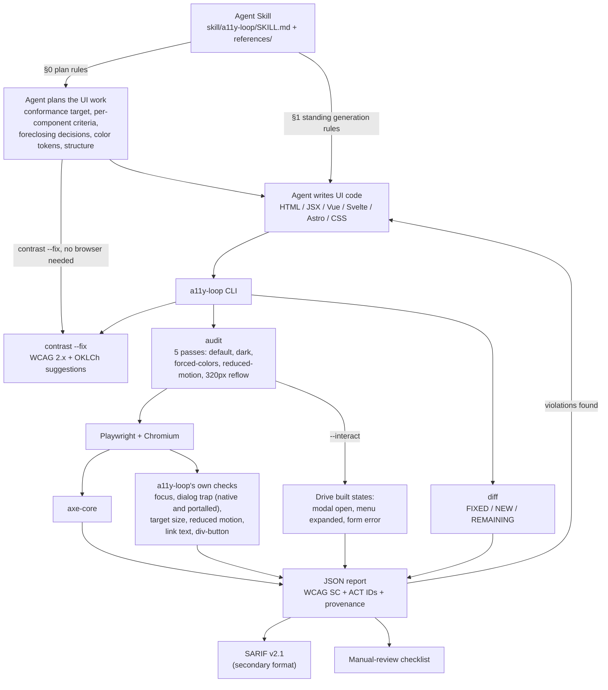
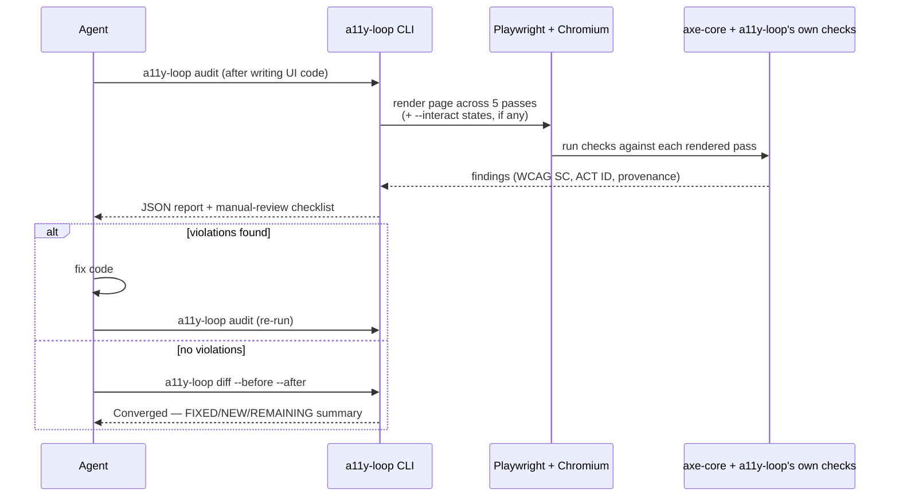

# Architecture & the Loop

a11y-loop is two things working together: an **Agent Skill** that sets the rules — first while the
UI work is being planned, then while the agent writes the code — and a **Node CLI** that verifies
the rendered result in a real browser and feeds failures back to the agent until the report
converges.

The skill's phases run in that order. §0 settles the decisions that are cheap now and expensive
later (conformance target, per-component criteria, foreclosing decisions, color tokens, structure);
§1 governs the code as it is written; §2 is the audit loop below; §3 governs what may be claimed
about the result. Only §2 needs a browser — see
[Planning with Accessibility](/guide/planning) for the phase that runs before any of this exists.

## One audit-fix-reaudit cycle

The flow in words: the skill's §0 puts the accessibility decisions in the plan, where changing them
is still a sentence; §1 sets standing rules while the agent writes the UI; `a11y-loop audit`
verifies the rendered result across five passes plus any built interaction states; violations feed
back to the agent to fix; `a11y-loop diff` confirms convergence without new regressions; the JSON
report and its manual-review checklist are the artifact of record, with SARIF offered as a
secondary format for tools that consume it.

Only the plan phase has an enforcement point outside the skill itself: in Claude Code, the
[optional plugin layer](/guide/getting-started#optional-the-claude-code-plugin-layer) hooks
`ExitPlanMode` and declines a UI plan with no accessibility content once. It checks that the
question was asked, not that the answer is any good — the audit loop above and a human reviewer are
still what judge the answer.

## Tech stack

- **Runtime:** Node.js ≥ 20, ESM
- **Browser automation:** [Playwright](https://playwright.dev/) (Chromium)
- **Accessibility engine:** [axe-core](https://github.com/dequelabs/axe-core) via `@axe-core/playwright`
- **Color math:** [culori](https://github.com/Evercoder/culori) (OKLCh contrast fixes)
- **Focus order:** [tabbable](https://github.com/focus-trap/tabbable)
- **SARIF conversion:** [axe-sarif-converter](https://github.com/microsoft/axe-sarif-converter)
- **Agent integration:** the open [Agent Skills](https://agentskills.io/specification) standard

See the [README's Tech Stack section](https://github.com/ChanMeng666/a11y-loop#%EF%B8%8F-tech-stack)
for licensing details (axe-core is MPL-2.0, separate from this project's MIT license).
