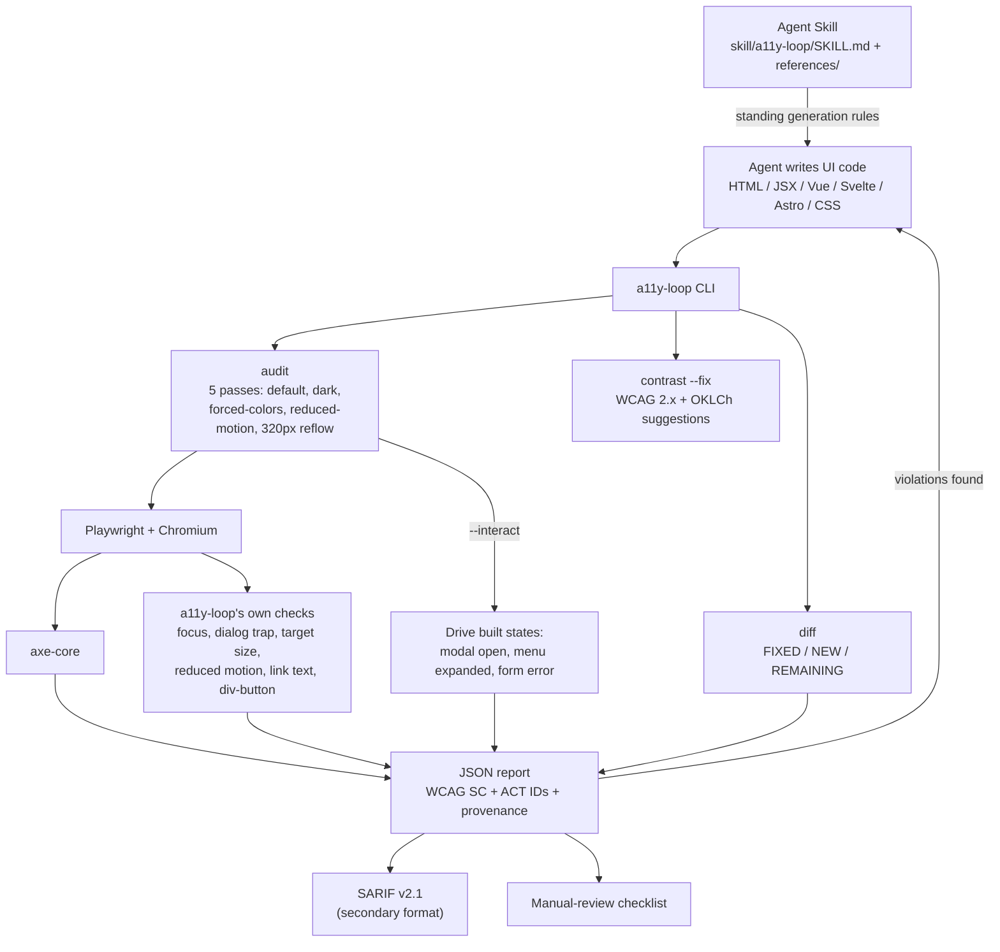
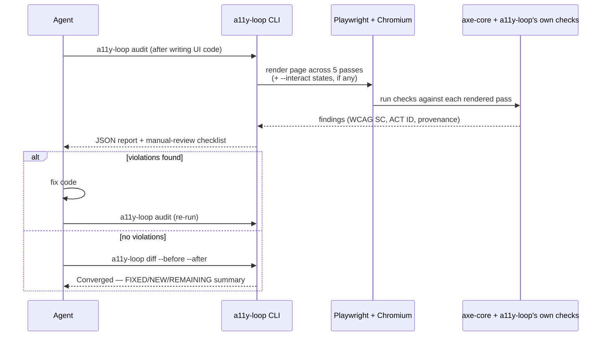

# Architecture & the Loop

a11y-loop is two things working together: an **Agent Skill** that sets standing generation rules
while an AI agent writes UI code, and a **Node CLI** that verifies the rendered result in a real
browser and feeds failures back to the agent until the report converges.

## One audit-fix-reaudit cycle

## Tech stack

- **Runtime:** Node.js ≥ 20, ESM
- **Browser automation:** [Playwright](https://playwright.dev/) (Chromium)
- **Accessibility engine:** [axe-core](https://github.com/dequelabs/axe-core) via `@axe-core/playwright`
- **Color math:** [culori](https://github.com/Evercoder/culori) (OKLCh contrast fixes)
- **Focus order:** [tabbable](https://github.com/focus-trap/tabbable)
- **SARIF conversion:** [axe-sarif-converter](https://github.com/microsoft/axe-sarif-converter)
- **Agent integration:** the open [Agent Skills](https://agentskills.io/specification) standard

See the [README's Tech Stack section](https://github.com/ChanMeng666/a11y-loop#%EF%B8%8F-tech-stack)
for licensing details (axe-core is MPL-2.0, separate from this project's MIT license).
