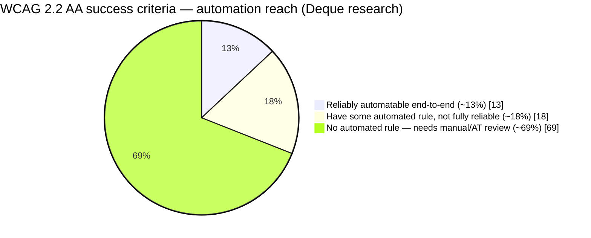

# Honest Coverage

Automated accessibility testing has a real, bounded scope, and a11y-loop says so in every report
rather than implying otherwise.

- Deque's own research puts automated coverage at **~57% of accessibility issues by volume**
  across a 13,000+ page / ~300,000 issue study — but only **~31% of WCAG 2.2 AA success criteria**
  have *any* automated rule at all, and only **~13% are reliably automatable** end-to-end.

- **A clean a11y-loop report means "no automatically detectable failures were found" — it is
  never a conformance or compliance claim**, and the tool will not tell you your app is
  accessible, compliant, or free of legal risk. No single score is ever produced.
- Every run emits a **generated manual-review checklist**, scoped to the components actually
  built, naming the criteria that need a human and/or assistive-technology testing (screen reader
  behavior, descriptive quality of alt text and link text, logical reading order, caption/media
  alternative accuracy, cognitive accessibility) — the direct inverse of "no manual testing
  needed."
- axe-core's own `incomplete` results are surfaced as `needsReview`, not suppressed. See the
  [benchmark write-up](https://github.com/ChanMeng666/a11y-loop/blob/main/evals/benchmark-results.md)
  for a live example of two such findings being investigated and resolved rather than dismissed.
- **The engine is wrong sometimes, and the honest thing is to say where.** A handful of rows have
  a known non-defect explanation — contrast in the forced-colors pass being the loudest. They are
  written up in [Field Notes](/guide/field-notes), with what to check before dismissing one.
  Verifying a row is not the same as suppressing it, and a11y-loop suppresses nothing.
- **SARIF caveat, stated honestly:** GitHub Code Scanning only displays SARIF results that carry a
  file-path location. a11y-loop's findings are located by rendered URL + CSS selector, which
  Code Scanning drops on ingestion — a naive upload produces an empty Code Scanning view. SARIF
  output is provided for the Azure DevOps SARIF viewer, the VS Code SARIF extension, and other
  SARIF-consuming tooling; the JSON report remains the primary, complete format.
- Findings are tagged with the **lowest WCAG version** that contains them (2.0 / 2.1 / 2.2), so you
  can filter to the subset a given jurisdiction actually enforces — e.g. US ADA Title II and
  Section 508 to the 2.0/2.1 AA subset, EU EN 301 549 to 2.1 AA (moving to 2.2 AA around October
  2026), NZ and UK to the full 2.2 AA set.

## What this is not

a11y-loop does not claim compliance, does not guarantee accessibility, and does not replace manual
testing or testing with assistive technology.

For the full, current statement (kept in sync with the project's own claim-honesty rules), see the
[README's Honest Coverage section](https://github.com/ChanMeng666/a11y-loop#-honest-coverage).
